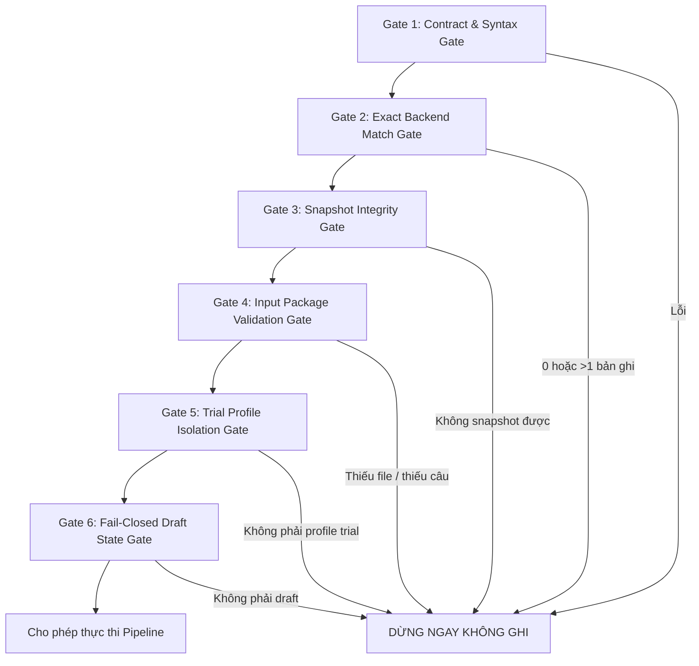
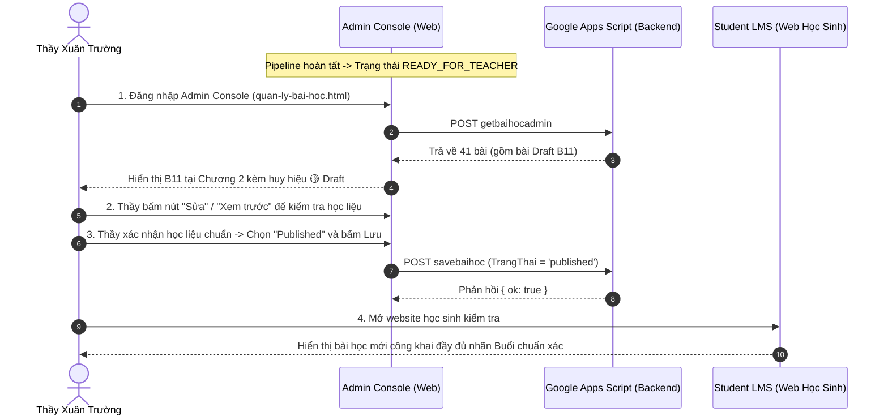

# QUY CHUẨN XƯỞNG XUẤT BẢN BÀI HỌC TỰ ĐỘNG (AUTO-PUBLISH LESSON SPEC)
## Phiên bản: 1.0 (Chuẩn hóa dựa trên Pilot B11 Thành Công — 2026-09-09)
### Áp dụng cho: Hệ thống Giáo dục Vật Lý Xuân Trường (VLXT)

---

## 1. MỤC TIÊU VÀ NGUYÊN TẮC CỐT LÕI

Quy chuẩn này định nghĩa toàn bộ quy trình vận hành tự động cho "Xưởng xuất bản bài học" (Lesson Publishing Pipeline). Quy trình đảm bảo đưa toàn bộ học liệu của một bài giảng (video bài giảng, video chữa bài, 3 file PDF, câu hỏi dừng video kèm timestamp, bài tập trắc nghiệm) lên hạ tầng production một cách an toàn tuyệt đối.

### 4 Nguyên tắc Sống còn
1. **Bảo mật & Thất bại Đóng (Fail-Closed Security)**:
   - Bài học mới tải lên bắt buộc phải ở trạng thái **`draft`**.
   - Mọi truy vấn công khai của học sinh (public GET) đều bị chặn hoàn toàn: không thấy bài, không thấy video, không thấy câu hỏi.
2. **Không Rò rỉ Thông tin Xác thực (Zero-Credential Leakage)**:
   - Tuyệt đối KHÔNG đọc Chrome/Edge LevelDB, localStorage, file token, client secret, `.clasprc`, OAuth credentials hay `ADMIN_KEY`.
   - Tuyệt đối KHÔNG in, đoán, log bí mật dưới mọi hình thức.
3. **Bảo toàn Dữ liệu & Tính Bất biến (Data Integrity & Idempotency)**:
   - Snapshot đầy đủ trước khi thực hiện bất kỳ thao tác ghi nào.
   - Cơ chế checkpoint lưu vết từng bước, hỗ trợ resume khi gián đoạn mà không gây trùng lặp hay ghi đè bừa bãi.
4. **Quyền Xuất bản Thuộc về Thầy (Teacher-Controlled Publish)**:
   - AI chỉ được phép dừng ở trạng thái `READY_FOR_TEACHER` (Draft đã kiểm chứng).
   - Tuyệt đối KHÔNG tự ý chuyển từ `draft` sang `published`. Chỉ Thầy mới có quyền duyệt và bấm nút xuất bản.

---

## 2. CẤU TRÚC GÓI HỌC LIỆU ĐẦU VÀO (INPUT PACKAGE) VÀ MANIFEST SCHEMA

### 2.1. Cấu trúc thư mục chuẩn của một bài học
Mỗi bài học cần xuất bản phải nằm trong một thư mục package độc lập (ví dụ: `inbox/b11-pilot/`):

```text
inbox/<lesson-package>/
├── manifest.json                  # File cấu hình định danh và metadata bài học (BẮT BUỘC)
├── video_theory.mp4               # Video bài giảng lý thuyết (định dạng MP4 H.264/AAC)
├── video_practice.mp4             # Video bài tập / chữa đề (định dạng MP4 H.264/AAC)
├── theory.pdf                     # Tài liệu PDF bản Lý thuyết
├── applied.pdf                    # Tài liệu PDF bản Bài tập áp dụng
├── practice.pdf                   # Tài liệu PDF bản Bài tập luyện tập
├── questions_applied_raw.json     # 20 câu hỏi trắc nghiệm dừng video có mốc thời gian (timestamp)
├── questions_practice_raw.json    # 20 câu hỏi trắc nghiệm bài tập luyện tập (4 lựa chọn A-B-C-D)
├── subtitles.srt / subtitles.vtt  # File phụ đề video (nếu có)
├── transcript.json                # Bóc băng nội dung video (nếu có)
├── timestamps_report.json         # Báo cáo đối soát timestamp khớp nội dung video
├── snapshot_<mabai>_before.json   # Bản snapshot tự động sinh ra trước khi ghi
└── .checkpoint.json               # File lưu trạng thái tiến độ pipeline
```

### 2.2. Schema chuẩn của `manifest.json`
`manifest.json` định nghĩa chính xác metadata mục tiêu và đường dẫn tài nguyên:

```json
{
  "$schema": "http://json-schema.org/draft-07/schema#",
  "title": "LessonManifest",
  "type": "object",
  "required": [
    "target",
    "metadata",
    "files"
  ],
  "properties": {
    "target": {
      "type": "object",
      "required": ["khoaHoc", "chuong", "tenBai"],
      "properties": {
        "khoaHoc": {
          "type": "string",
          "description": "Tên khóa học chính xác, vd: CHUYÊN ĐỀ LÝ THUYẾT GĐ1 - Vật Lý 12"
        },
        "chuong": {
          "type": "string",
          "description": "Tên chương chính xác, vd: Chương 2 – Khí lí tưởng"
        },
        "tenBai": {
          "type": "string",
          "description": "Tên bài chính xác, vd: B11. ĐỊNH LUẬT BOYLE – QUÁ TRÌNH ĐẲNG NHIỆT"
        },
        "maBai": {
          "type": "string",
          "description": "Mã bài duy nhất (nếu đã biết trước, để trống pipeline sẽ tự tìm kiếm)"
        }
      }
    },
    "metadata": {
      "type": "object",
      "required": ["thuTuBai", "trangThai"],
      "properties": {
        "thuTuBai": {
          "type": "integer",
          "description": "Thứ tự sắp xếp của bài trong chương (vd: 4)"
        },
        "trangThai": {
          "type": "string",
          "enum": ["draft"],
          "description": "Trạng thái bắt buộc khi nạp là 'draft'"
        },
        "moTaBai": {
          "type": "string",
          "description": "Mô tả tóm tắt nội dung bài học"
        },
        "ngayDang": {
          "type": "string",
          "description": "Ngày đăng ISO hoặc YYYY-MM-DD"
        }
      }
    },
    "files": {
      "type": "object",
      "required": ["videoTheory", "videoPractice", "pdfTheory", "pdfApplied", "pdfPractice", "questionsApplied", "questionsPractice"],
      "properties": {
        "videoTheory": { "type": "string" },
        "videoPractice": { "type": "string" },
        "pdfTheory": { "type": "string" },
        "pdfApplied": { "type": "string" },
        "pdfPractice": { "type": "string" },
        "questionsApplied": { "type": "string" },
        "questionsPractice": { "type": "string" }
      }
    }
  }
}
```

---

## 3. CÁC CỔNG KIỂM SOÁT AN TOÀN TRƯỚC KHI THỰC THI (PREFLIGHT GATES)

Trước khi gửi bất kỳ dữ liệu nào lên YouTube, Drive hay Google Sheets, pipeline bắt buộc phải vượt qua 6 cổng kiểm soát (Gates):



1. **Gate 1: Contract & Syntax Gate**
   - File `manifest.json` phải hợp lệ theo Schema.
   - Không chứa bất kỳ câu lệnh chèn mã độc hay tham số giả mạo.
2. **Gate 2: Exact Backend Match Gate (Tìm kiếm Độc bản)**
   - Sử dụng lệnh POST authenticated `getbaihocadmin` lên backend GAS production.
   - Lọc chính xác theo bộ ba: `KhoaHoc == target.khoaHoc` VÀ `Chuong == target.chuong` VÀ `TenBai == target.tenBai`.
   - **Ràng buộc nghiêm ngặt**: Kết quả tìm kiếm bắt buộc phải trả về **CHÍNH XÁC 1 BẢN GHI DUY NHẤT**. Nếu trả về 0 bản ghi hoặc nhiều hơn 1 bản ghi, pipeline lập tức **DỪNG**, tuyệt đối không ghi đè hay tạo bừa.
3. **Gate 3: Snapshot Integrity Gate**
   - Snapshot đầy đủ dữ liệu nguyên trạng trước khi ghi:
     - 14 trường hiện tại của dòng `BaiHoc`.
     - Danh sách câu hỏi hiện có trong sheet `VideoCauHoi` theo `MaBai`.
     - Danh sách câu hỏi hiện có trong sheet `BaiTapTracNghiem` theo `baiKey`.
   - File snapshot phải được ghi thành công vào `snapshot_<mabai>_before.json`.
4. **Gate 4: Input Package Validation Gate**
   - File MP4 tồn tại, dung lượng $> 0$, đọc được metadata thời lượng.
   - 3 file PDF tồn tại, định dạng hợp lệ.
   - `questions_applied_raw.json`: Đủ 20 câu trắc nghiệm, mỗi câu có trường `t` (timestamp giây) hợp lệ trong phạm vi thời lượng video, đáp án đúng thuộc `[A, B, C, D]`.
   - `questions_practice_raw.json`: Đủ 20 câu trắc nghiệm, có đủ `question`, `optA`, `optB`, `optC`, `optD`, và `correct`.
5. **Gate 5: Trial Profile Isolation Gate**
   - Video tải lên YouTube bắt buộc phải được thiết lập `privacyStatus: "private"`.
   - File PDF tải lên Google Drive phải được đưa vào thư mục Trial riêng biệt (ví dụ: `[TRIAL] Bài 11...` ID `17g57kX8pcGv5X-SDxMbJ8KFQI64qhdTX`), không ghi đè lên thư mục chính thức của học sinh.
6. **Gate 6: Fail-Closed Draft State Gate**
   - Trường `TrangThai` trong payload gửi lên backend bắt buộc phải là chuỗi `"draft"`.

---

## 4. CHẾ ĐỘ THỰC THI: TRIAL VS. LIVE

Pipeline hỗ trợ 2 chế độ rõ ràng, ngăn ngừa việc nhầm lẫn môi trường:

| Tiêu chí | Chế độ `--mode=trial` (Mặc định cho Pilot) | Chế độ `--mode=live` (Sau khi Thầy duyệt) |
| :--- | :--- | :--- |
| **YouTube Privacy** | **`private`** (Chỉ tài khoản sở hữu kênh xem được) | **`unlisted`** (Không công khai, chỉ nhúng web) |
| **Google Drive** | Thư mục `[TRIAL]` độc lập | Thư mục học liệu chính thức |
| **Trạng thái bài học** | **`draft`** | **`published`** |
| **Học sinh xem được?** | **HOÀN TOÀN KHÔNG** (Ẩn 100% trên API/Web) | **CÓ** (Hiển thị đầy đủ) |
| **Yêu cầu phê duyệt** | AI tự động chạy theo task Thầy giao | **Bắt buộc có phê duyệt bằng văn bản của Thầy** |

---

## 5. CƠ CHẾ CHECKPOINT, RESUME VÀ BẢO ĐẢM TÍNH BẤT BIẾN (IDEMPOTENCY)

Để chống lỗi gián đoạn mạng, sập nguồn hoặc timeout:
- File `.checkpoint.json` được cập nhật sau mỗi bước thành công.
- Khi chạy lại, pipeline đọc `.checkpoint.json`: nếu video/PDF đã có ID tải lên hợp lệ, pipeline bỏ qua bước upload và chuyển sang bước tiếp theo, tránh upload trùng lặp tài nguyên.

### Các nấc trạng thái trong `.checkpoint.json`:
1. `INIT`: Bắt đầu phiên làm việc.
2. `SNAPSHOT_TAKEN`: Đã snapshot thành công dữ liệu trước ghi.
3. `YOUTUBE_UPLOADED`: Đã upload xong 2 video YouTube Private (lưu kèm video ID).
4. `DRIVE_UPLOADED`: Đã upload xong 3 PDF vào thư mục Trial (lưu kèm Drive file ID).
5. `BACKEND_WRITTEN`: Đã ghi thành công bài học `draft` và nạp 40 câu hỏi vào Sheets.
6. `VERIFIED_DRAFT`: Đã vượt qua 7 cổng đối soát nghiệm thu read-back và public leak check.
7. `READY_FOR_TEACHER`: Toàn bộ quy trình hoàn tất, sẵn sàng bàn giao Thầy nghiệm thu.

---

## 6. QUY TRÌNH ĐỐI SOÁT NGHIỆM THU (7 GATES AUDIT)

Sau khi ghi dữ liệu lên backend, pipeline tự động chạy quy trình kiểm chứng 7 cổng độc lập trước khi báo cáo hoàn tất:

| Gate | Đối soát | Tiêu chuẩn ĐẠT (PASS) | Hành động khi FAIL |
| :--- | :--- | :--- | :--- |
| **Gate 5.1** | Read-back 11 trường bài học từ `getbaihocadmin` | Khớp 100% từng trường: `KhoaHoc`, `Chuong`, `TenBai`, `ThuTuBai`, `MoTaBai`, `Video`, `VideoGiai`, `PDFLyThuyet`, `PDF`, `PDFLuyenTap`, `TrangThai: 'draft'`. | Ném lỗi `FIELD_MISMATCH` $\rightarrow$ Rollback |
| **Gate 5.2** | Read-back câu hỏi video từ `getvideocauhoiadmin` | Đủ đúng 20 câu hỏi, timestamp và đáp án đúng khớp 100%. | Ném lỗi `VIDEO_QUESTIONS_MISMATCH` $\rightarrow$ Rollback |
| **Gate 5.3** | Read-back bài tập từ `getbaitaptracnghiemadmin` | Đủ đúng 20 câu bài tập trắc nghiệm, 4 lựa chọn A-B-C-D và đáp án khớp 100%. | Ném lỗi `PRACTICE_QUESTIONS_MISMATCH` $\rightarrow$ Rollback |
| **Gate 5.4** | Public GET `?type=baihoc` | Bài học mới **TUYỆT ĐỐI KHÔNG XUẤT HIỆN** trong danh sách bài học công khai của học sinh. | Ném lỗi `PUBLIC_LEAK_DETECTED` $\rightarrow$ Rollback Khẩn Cấp |
| **Gate 5.5** | Public GET `?type=videocauhoi&bai=<MaBai>` | Trả về `{ data: [] }` rỗng (bị chặn fail-closed). | Ném lỗi `PUBLIC_LEAK_DETECTED` $\rightarrow$ Rollback Khẩn Cấp |
| **Gate 5.6** | Public GET `?type=baitaptracnghiem&bai=<MaBai>` | Trả về `{ data: [] }` rỗng (bị chặn fail-closed). | Ném lỗi `PUBLIC_LEAK_DETECTED` $\rightarrow$ Rollback Khẩn Cấp |
| **Gate 5.7** | Bảo vệ bài học lân cận (vd: Bài 10 thật) | Kiểm tra bài học lân cận nguyên vẹn 100% (14/14 trường không suy suyển). | Ném lỗi `NEIGHBOR_CORRUPTED` $\rightarrow$ Rollback Khẩn Cấp |

---

## 7. QUY TRÌNH THẦY DUYỆT DRAFT RỒI XUẤT BẢN (PUBLISH WORKFLOW)



### Quy tắc bất biến:
1. **AI tuyệt đối không tự bấm xuất bản**: Sau khi pipeline nạp xong `draft`, AI chỉ bàn giao checkpoint và bằng chứng cho Thầy.
2. **Quyền quyết định 100% thuộc về Thầy**: Thầy xem xét bài học trên Admin Console. Nếu ưng ý, Thầy tự chọn trạng thái `Published` trên giao diện Admin hoặc ra lệnh rõ ràng cho AI.

---

## 8. QUY TRÌNH HOÀN TÁC VÀ KHÔI PHỤC SNAPSHOT (ROLLBACK PROCEDURE)

Nếu xảy ra bất kỳ sự cố nào trong quá trình chạy thử nghiệm hoặc đối soát nghiệm thu thất bại:

### Các bước Rollback tự động / thủ công:
1. **Bước 1: Nạp Snapshot**:
   - Đọc file `snapshot_<mabai>_before.json`.
2. **Bước 2: Khôi phục Bảng Bài Học**:
   - Gửi payload authenticated `savebaihoc` phục hồi nguyên trạng 14 trường ban đầu của bài học (xóa link video, xóa link PDF, đặt lại trạng thái cũ).
3. **Bước 3: Xóa Dữ Liệu Câu Hỏi Mới Nạp**:
   - Gửi payload authenticated `savevideocauhoi` với `baiKey = MaBai` và `data = []` (hoặc dữ liệu câu hỏi cũ nếu trước đó có).
   - Gửi payload authenticated `savebaitaptracnghiem` với `baiKey = MaBai` và `data = []` (hoặc dữ liệu cũ).
4. **Bước 4: Xóa / Thu hồi Tài nguyên Đám mây**:
   - Xóa 2 video đã tải lên trên YouTube bằng YouTube Data API (hoặc giữ ở Private).
   - Xóa các file PDF trong thư mục Trial trên Google Drive.
5. **Bước 5: Kiểm chứng Sau Hoàn tác**:
   - Đọc lại dữ liệu backend để đảm bảo hệ thống đã quay về trạng thái ban đầu 100%.
   - Cập nhật `.checkpoint.json` với trạng thái `ROLLED_BACK`.

---

## 9. CÁC ĐIỀU CẤM TUYỆT ĐỐI (NON-NEGOTIABLE CONSTRAINTS)

1. **CẤM đọc secret/localStorage/token**: Không đọc Chrome/Edge LevelDB, file `.clasprc`, OAuth token hay `ADMIN_KEY`. Sử dụng các module pipeline trung gian có sẵn, không tự tạo script đọc trộm khóa.
2. **CẤM tự ý Publish**: Không tự tiện đổi `TrangThai: 'draft'` thành `'published'` nếu chưa có chỉ thị rõ ràng của Thầy.
3. **CẤM ghi đè học liệu nguồn**: Thư mục bài học gốc (như B10) chỉ được đọc để tham chiếu, tuyệt đối không sửa đổi file gốc.
4. **CẤM bypass Preflight Gates**: Không được tắt cờ kiểm tra hay bỏ qua bất kỳ bước nào trong 7 cổng đối soát nghiệm thu.
5. **CẤM sửa nóng trên nhánh `main`**: Mọi cập nhật code pipeline hay giao diện phải đi qua branch riêng và PR sạch.
