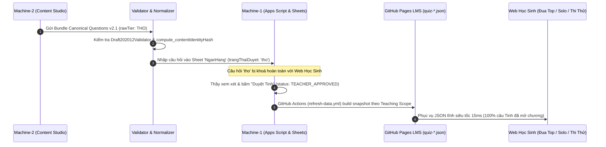

# BẢNG ÁNH XẠ TOÀN DIỆN: CANONICAL SCHEMA V2.1 $\longleftrightarrow$ WEBSITE PLATFORM
**Dự án**: Nền tảng Website Vật Lý Xuân Trường  
**Cơ quan ban hành**: MACHINE-1 (Production Owner) phối hợp MACHINE-2 (Content Studio)  
**Phiên bản**: v2.1.0  
**Ngày ban hành**: 27/08/2026  

---

## 1. Nguyên Tắc Ánh Xạ Không Mất Mát Dữ Liệu (Lossless Mapping Principles)

1. **Bảo toàn 100% ngữ nghĩa**: Mọi thuộc tính sư phạm (độ khó, phân loại, nguồn gốc, cờ chất lượng) trong Canonical Schema v2.1 đều có vị trí lưu trữ xác định trên hệ thống Website.
2. **Đồng bộ Định dạng Toán & Đa phương tiện**: Công thức LaTeX chuẩn hóa theo cú pháp KaTeX (`$...$` và `$$...$$`), hình ảnh đồ thị ánh xạ trực tiếp sang đường dẫn web/CDN (`mediaAssets[].webPath`).
3. **Cơ chế Snapshot Đề thi Bất biến**: Khi xuất bản đề thi, toàn bộ đối tượng Canonical Question được chụp nguyên vẹn vào mảng `questionsSnapshot`.

---

## 2. Bảng Ánh Xạ Chi Tiết Từng Trường Dữ Liệu (Field-by-Field Matrix)

| STT | Trường Canonical Schema v2.1 | Cột Google Sheets `NganHang` | Bảng Google Sheets `VideoCauHoi` | JSON LMS Tĩnh (`quiz-*.json`) | Chuyển Đổi & Xử Lý Kỹ Thuật | Mất dữ liệu? | Quyết Định Đề Xuất |
| :---: | :--- | :--- | :--- | :--- | :--- | :---: | :--- |
| **1** | `schemaVersion` | Metadata / Header | - | `schemaVersion` | Giữ nguyên chuỗi `"2.1.0"`. | **Không** | Bắt buộc ghi nhận phiên bản. |
| **2** | `id` | Cột A (`id`) | Cột A (`id`) | `questions[].id` | Giữ nguyên mã chuẩn (VD: `VLXT-G12-C1-B01-Q0001`). Bất biến. | **Không** | Khóa chính xuyên suốt. |
| **3** | `version` | Cột S (`version`) | - | `questions[].version` | Số nguyên $\ge 1$. Tự tăng khi nội dung câu thay đổi. | **Không** | Dùng quản lý lịch sử phiên bản. |
| **4** | `parentId` | Cột I (`nhomId`) | - | `questions[].parentId` | Lưu ID nhóm cha nếu là câu con của `QUESTION_GROUP`. | **Không** | Thiết lập liên kết 2 chiều. |
| **5** | `contentHash` | Cột T (`contentHash`) | - | `questions[].contentHash` | SHA-256 mã hóa danh tính ngữ nghĩa (`contentIdentityHash`). | **Không** | Dùng chống nạp trùng lặp. |
| **6** | `type` | Cột G (`dangCauHoi`) | Cột E (`type`) | `questions[].type` | `MULTIPLE_CHOICE_4` $\rightarrow$ `TN4` `TRUE_FALSE_4PART` $\rightarrow$ `DS` `SHORT_ANSWER` $\rightarrow$ `TLN` `QUESTION_GROUP` $\rightarrow$ `CHUM` | **Không** | Đồng bộ enum định dạng câu. |
| **7** | `stem` | Cột K (`question`) | Cột F (`question`) | `questions[].question` | Văn bản chứa Markdown & KaTeX LaTeX. | **Không** | Chuẩn hóa LaTeX bằng `normalizer.py`. |
| **8** | `khoaHoc` | Cột C (`khoaHoc`) | - | `courseSlug` | Enum Canonical $\leftrightarrow$ Web slug (VD: `XPS_2K9` $\leftrightarrow$ `vatly12_lythuyet_gd1`). | **Không** | Dùng bảng tra cứu alias. |
| **9** | `giaiDoan` | Cột D (`giaiDoan`) | - | `stage` | `GD1_LY_THUYET` $\rightarrow$ `GD1`, `GD2_LUYEN_DANG` $\rightarrow$ `GD2`, v.v. | **Không** | Chuẩn hóa 4 giai đoạn lộ trình. |
| **10** | `options` | Cột L (`optA`), (`optB`), (`optC`), (`optD`) | Cột G-J (`optA..D`) | `questions[].options` | Tách 4 phần tử mảng thành 4 cột A, B, C, D trên Sheets; LMS giữ mảng hoặc object `{A,B,C,D}`. | **Không** | Bắt buộc đúng 4 options cho TN4. |
| **11** | `subItems` | Cột L (`optA..D`) + Cột M (`correct`) | - | `questions[].subItems` | `subItems[i].statement` lưu vào `optA..D`; `isCorrect` chuyển thành chuỗi `"Đ,S,S,Đ"` trên Sheets; LMS giữ nguyên cấu trúc object. | **Không** | Bảo toàn lời giải từng mệnh đề. |
| **12** | `correctAnswer` | Cột M (`correct`) | Cột K (`correct`) | `questions[].correct` | - TN4: `"A"`, `"B"`, `"C"`, `"D"` - TLN: Chuỗi số (VD: `"12.5"`). | **Không** | Viết hoa và trim ký tự. |
| **13** | `numericValue` | Cột U (`numericValue`) | - | `questions[].numericValue` | Lưu giá trị số thực (Float/Int) của câu Trả lời ngắn. | **Không** | Dùng cho thuật toán chấm điểm tự động. |
| **14** | `tolerance` | Cột V (`tolerance`) | - | `questions[].tolerance` | Lưu sai số cho phép (VD: `0.05`). | **Không** | Mặc định `0.0` nếu null. |
| **15** | `unit` | Cột W (`unit`) | - | `questions[].unit` | Lưu đơn vị vật lý chuẩn (VD: `\text{m/s}^2`, `\text{J}`). | **Không** | Hiển thị kèm ô nhập đáp số. |
| **16** | `acceptedAnswers` | Cột X (`acceptedAnswers`) | - | `questions[].acceptedAnswers` | Chuỗi JSON phân tách mảng các đáp án hợp lệ. | **Không** | Hỗ trợ học sinh nhập nhiều dạng số. |
| **17** | `childQuestionIds` | Cột Y (`childQuestionIds`) | - | `questions[].childQuestionIds` | Mảng ID câu con (phân tách dấu phẩy trên Sheets). | **Không** | Chỉ áp dụng cho `QUESTION_GROUP`. |
| **18** | `introText` | Cột J (`deBaiChung`) | - | `questions[].introText` | Đoạn văn bản ngữ cảnh dẫn nhập cho câu chùm. | **Không** | Hiển thị cố định ở đầu cụm câu hỏi. |
| **19** | `explanation` | Cột N (`giaiThich`) | - | `questions[].explanation` | Lời giải chi tiết + Phương pháp giải nhanh. | **Không** | Hỗ trợ KaTeX và khối giải thích. |
| **20** | `difficultyLevel` & `difficultyName` | Cột H (`mucDo`) | Cột L (`mucDo`) | `questions[].level` | 1 $\rightarrow$ `NB` (Nhận biết) 2 $\rightarrow$ `TH` (Thông hiểu) 3 $\rightarrow$ `VD` (Vận dụng) 4 $\rightarrow$ `VDC` (Vận dụng cao) | **Không** | Ánh xạ 2 chiều số $\leftrightarrow$ mã chữ. |
| **21** | `taxonomy` | Cột E (`chuong`) & Cột F (`baiHoc`) | Cột B (`maBai`) | `questions[].taxonomy` | `chapterNumber` + `chapterTitle` $\rightarrow$ `chuong` `lessonCode` + `lessonTitle` $\rightarrow$ `baiHoc` (kèm bảng alias `MaBai`). | **Không** | Chuẩn hóa danh mục bài học. |
| **22** | `sourceProvenance` | Cột O (`nguon`) | - | `questions[].provenance` | Nối chuỗi `sourceTitle` + `sourceAuthor` + `originalQuestionNumber` trên Sheets; LMS lưu đủ object. | **Không** | Lưu vết nguồn gốc tài liệu. |
| **23** | `originalityStatus` | Cột P (`trangThaiBanQuyen`) | - | `questions[].originality` | `ORIGINAL` $\rightarrow$ `doc_quyen_vlxt` `PUBLIC_DOMAIN` $\rightarrow$ `cong_khai_tham_khao` `ADAPTED` $\rightarrow$ `chuyen_nhuong` | **Không** | Quản lý quyền sở hữu trí tuệ. |
| **24** | `qualityFlags` | Cột Z (`qualityFlags`) | - | `questions[].flags` | Chuỗi danh sách cờ phân tách dấu phẩy. | **Không** | Giúp Admin lọc câu cần vẽ lại ảnh... |
| **25** | `usageScopes` | Cột B (`loaiNganHang`) | - | `questions[].scopes` | Danh sách enum Canonical ánh xạ sang mã phân hệ web (`DUA_TOP_FAST_QUIZ`, `SOLO_PVP`, `EXAM_BANK`...). | **Không** | Điều khiển phạm vi xuất bản. |
| **26** | `mediaAssets` | Cột Q (`hinhAnh`) | Cột N (`mediaUrl`) | `questions[].mediaAssets` | Mảng URLs hình ảnh (phân tách dấu phẩy trên Sheets); LMS lưu mảng object đầy đủ `assetType`, `binding`. | **Không** | Tự động tải từ WebPath / CDN. |
| **27** | `inVideoCue` | - | Cột J (`thoiGian`) & Cột M (`pause`) | `questions[].inVideoCue` | `timestampSeconds` (giây dừng video) + `pauseRequired`. | **Không** | Phục vụ tính năng Video Quiz. |
| **28** | `reviewedBy` & `reviewedAt` | Cột AA (`reviewedBy`) & Cột AB (`reviewedAt`) | - | - | Tên định danh Thầy duyệt & thời điểm phê duyệt. | **Không** | Chỉ ghi nhận khi Thầy duyệt thật. |
| **29** | `status` & `rawTier` | Cột R (`trangThaiDuyet`) | Cột O (`chatLuong`) | `questions[].tier` | `status IN ['DRAFT', 'QA_PASSED']` $\rightarrow$ `rawTier = "THO"` $\rightarrow$ `"tho"` `status IN ['TEACHER_APPROVED', 'PUBLISHED']` $\rightarrow$ `rawTier = "TINH"` $\rightarrow$ `"da_duyet_tinh"` | **Không** | **Rào chắn an toàn tuyệt đối**. |

---

## 3. Quy Trình Chuyển Đổi Dữ Liệu Hai Chiều (Bidirectional Pipeline)

---

## 4. Cam Kết Toàn Vẹn Dữ Liệu Giữa Hai Bên
1. **MACHINE-2 cam kết**: Mọi câu hỏi xuất xưởng đều đạt chuẩn JSON Schema v2.1, đã chuẩn hóa công thức KaTeX, và tính toán đúng mã `contentIdentityHash`.
2. **MACHINE-1 cam kết**: Mọi quy trình import trên Admin Console đều bảo toàn toàn bộ 29 trường ánh xạ trên, không làm mất thuộc tính và áp dụng nghiêm ngặt bộ lọc `rawTier == "TINH"` cho học sinh.
